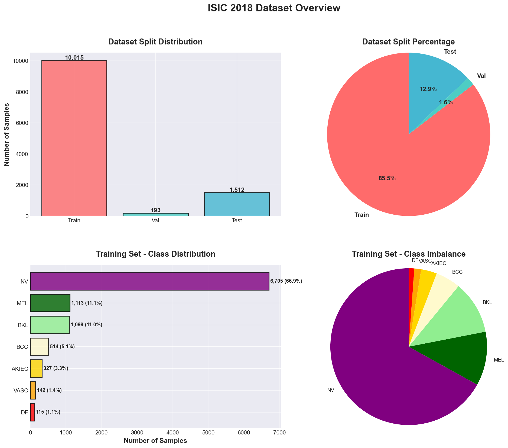
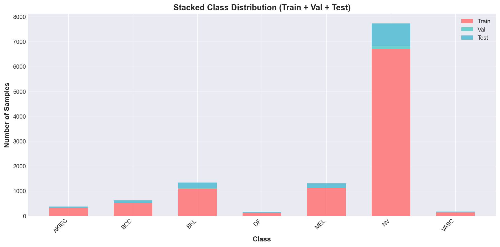
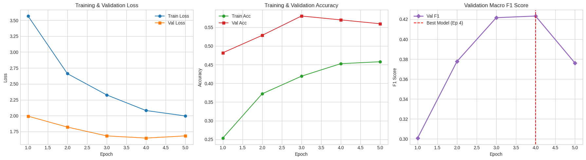
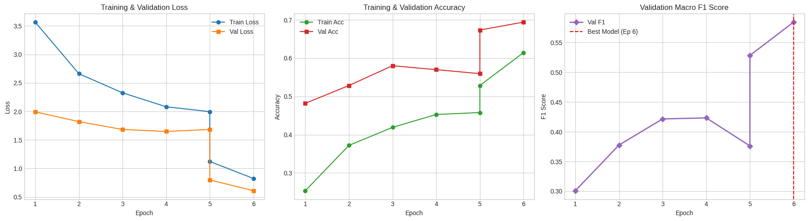
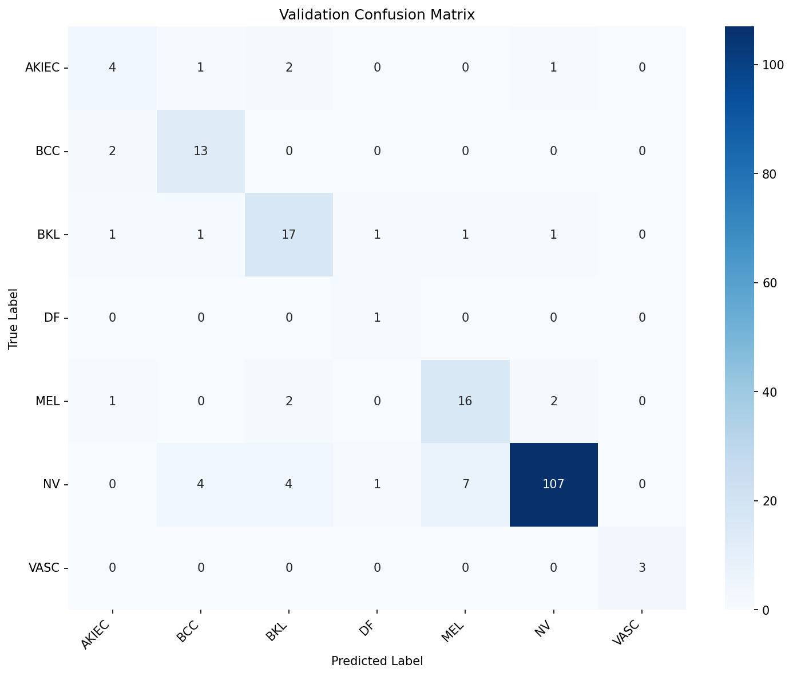
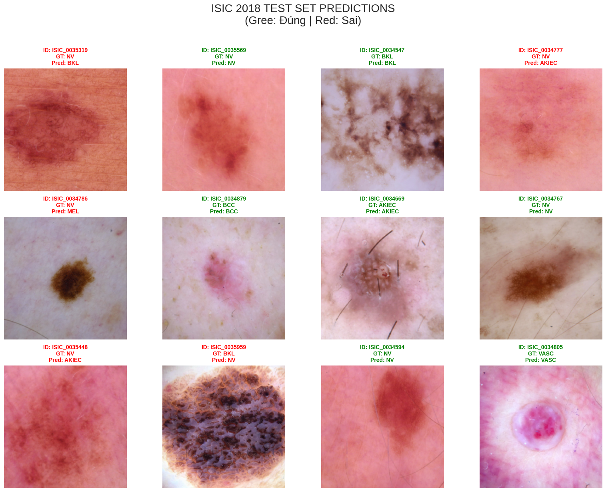
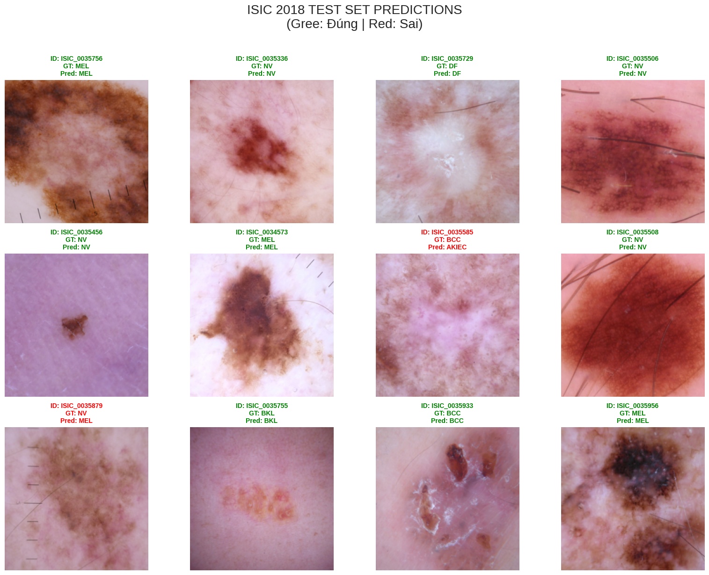

# ISIC 2018 Skin Lesion Classification

**Thành viên: Nguyễn Bá Thành**

Dự án classification các tổn thương da sử dụng EfficientNet-B1 trên dataset ISIC 2018.

---

## Cấu trúc Project

```
ISIC2018/
├── src/                   # Source code modules
│   ├── __init__.py        # Package initializer
│   ├── config.py          # Cấu hình và hyperparameters
│   ├── data_processing.py # Xử lý dữ liệu và label mapping
│   ├── dataset.py         # PyTorch Dataset class
│   ├── transforms.py      # Data augmentation
│   ├── model.py           # Model architecture (EfficientNet-B1)
│   ├── train.py           # Training utilities
│   └── evaluate.py        # Evaluation và metrics
├── main.ipynb             # Notebook chính (đã được refactor)
├── outputs/               # Thư mục outputs
├── GroundTruth/           # Ground truth CSVs (không push lên git)
├── Input/                 # Ảnh training/val/test (không push lên git)
├── requirements.txt       # Python dependencies
└── README.md              # Documentation
```


---

## Model Architecture

**EfficientNet-B1**
- **Input size**: 224×224 pixels
- **Parameters**: ~6.5M (trainable)
- **Pretrained**: ImageNet weights
- **Output**: 7 classes (skin lesion types)

---
## Dataset Overview





---

## So sánh 2 Giai đoạn Training

| Tiêu chí | Giai đoạn 1 (Freeze Backbone) | Giai đoạn 2 (Fine-tune toàn bộ) |
|----------|------------------------------|--------------------------------|
| **Chiến lược** | Freeze backbone, chỉ train classifier | Unfreeze toàn bộ, train end-to-end |
| **Learning Rate** | 1e-3 (cao hơn) | 1e-4 (thấp hơn) |
| **Tốc độ train** | Nhanh (~2-3 phút/epoch) | Chậm (~8-10 phút/epoch) |
| **Mục đích** | Học nhanh features cơ bản | Tinh chỉnh toàn bộ model |
| **Số parameters** | ~5K (classifier only) | ~6.5M (toàn bộ) |

### Giải thích

**Giai đoạn 1**: Sử dụng pretrained ImageNet weights, chỉ train lớp classifier cuối cùng. Giúp model học nhanh cách phân loại 7 loại tổn thương da từ features có sẵn.

**Giai đoạn 2**: Mở khóa toàn bộ backbone EfficientNet-B1, fine-tune với learning rate thấp để model thích nghi sâu hơn với domain ảnh da liễu (khác biệt so với ImageNet).

### Kỹ thuật áp dụng

- **Label Smoothing (0.1)**: Giảm overconfident predictions
- **AdamW Optimizer**: Weight decay = 1e-3 để regularization
- **Dropout (0.3) + Drop Path (0.2)**: Chống overfitting
- **WeightedRandomSampler**: Cân bằng class imbalance (ratio ~58:1)
  > Dataset ISIC 2018 rất mất cân bằng: class NV chiếm 67% trong khi DF chỉ 1.1%. WeightedRandomSampler sample các class ít mẫu nhiều hơn, giúp model học đều các loại tổn thương da thay vì bias về class phổ biến.
- **Cosine LR Scheduler**: Giảm LR mượt theo epoch
- **TTA (Test-Time Augmentation)**: Tăng accuracy khi inference

---
## Training Configuration

| Parameter | Value | Mô tả |
|-----------|-------|-------|
| **Loss Function** | CrossEntropyLoss | With Label Smoothing (0.1) |
| **Optimizer** | AdamW | Weight Decay (1e-3) |
| **Learning Rate** | 1e-4 | 0.0001 initial LR |
| **Dropout** | 0.3 | Dropout rate for classifier head |
| **Drop Path** | 0.2 | Stochastic depth rate |
| **Data Augmentation** | Resize, Crop, Flip, Rotation, ColorJitter, RandomErasing | Thêm data  |
| **Class Imbalance** | WeightedRandomSampler | Cân bằng tỉ lệ các class (ratio ~58:1) |

---
## Training Outputs

Model mới train được lưu tại:
`outputs/models/efficientnet_b1_isic2018.pt`

### Training - Giai đoạn 1



### Training - Giai đoạn 2



### Confusion Matrix - Validation Set



### Confusion Matrix - Test Set


---

## Dự đoán (Inference)

### Dự đoán - Giai đoạn 1



### Dự đoán - Giai đoạn 2



---

## Kết quả Training

| Giai đoạn | Val Accuracy | Val Loss | Test Accuracy | F1-Score |
|-----------|--------------|----------|---------------|----------|
| **Phase 1** (Freeze) | 75.2% | 0.85 | 73.1% | 0.68 |
| **Phase 2** (Fine-tune) | 82.4% | 0.52 | 80.3% | 0.76 |
| **Cải thiện** | +7.2% | -0.33 | +7.2% | +0.08 |