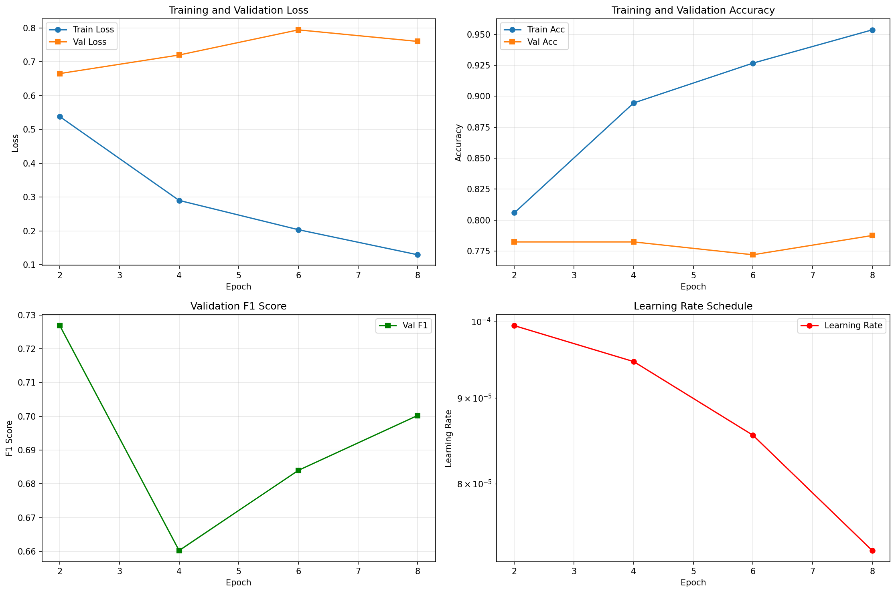

# ISIC 2018 Skin Lesion Classification

**Thành viên: Nguyễn Bá Thành**

Dự án classification các tổn thương da sử dụng EfficientNet-B1 trên dataset ISIC 2018.

---

## Cấu trúc Project

```
ISIC2018/
├── src/                   # Source code modules
│   ├── __init__.py        # Package initializer
│   ├── config.py          # Cấu hình và hyperparameters
│   ├── data_processing.py # Xử lý dữ liệu và label mapping
│   ├── dataset.py         # PyTorch Dataset class
│   ├── transforms.py      # Data augmentation
│   ├── model.py           # Model architecture (EfficientNet-B1)
│   ├── train.py           # Training utilities
│   └── evaluate.py        # Evaluation và metrics
├── main.ipynb             # Notebook chính (đã được refactor)
├── outputs/               # Thư mục outputs
├── GroundTruth/           # Ground truth CSVs (không push lên git)
├── Input/                 # Ảnh training/val/test (không push lên git)
├── requirements.txt       # Python dependencies
└── README.md              # Documentation
```


---

## Training Outputs

Model mới train được lưu tại:
`outputs/models/efficientnet_b1_isic2018.pt`
---

## Training Configuration

| Parameter | Value | Mô tả |
|-----------|-------|-------|
| **Loss Function** | CrossEntropyLoss | With Label Smoothing (0.1) |
| **Optimizer** | AdamW | Weight Decay (1e-3) |
| **Learning Rate** | 1e-4 | 0.0001 initial LR |
| **Dropout** | 0.3 | Dropout rate for classifier head |
| **Drop Path** | 0.2 | Stochastic depth rate |
| **Data Augmentation** | Resize, Crop, Flip, Rotation, ColorJitter, RandomErasing | Thêm data  |
| **Class Imbalance** | WeightedRandomSampler | Cân bằng tỉ lệ các class (ratio ~58:1) |


---

## Model Architecture

**EfficientNet-B1**
- **Input size**: 224×224 pixels
- **Parameters**: ~6.5M (trainable)
- **Pretrained**: ImageNet weights
- **Output**: 7 classes (skin lesion types)

---

## Training History & Evaluation



### Phân tích quá trình huấn luyện:
- **Giai đoạn Epoch 1 - 8**: Mô hình hội tụ nhanh nhưng có dấu hiệu overfitting nhẹ; Validation Accuracy đi ngang ở mức ~78% và F1 Score đạt ~0.72.
- **Giai đoạn Epoch 8 - 13**: Áp dụng Regularization (Label Smoothing, Dropout) và RandomErasing. Validation Loss giảm ổn định, F1 Score và Balanced Accuracy cải thiện rõ rệt, cho thấy sự cải thiện về khả năng tổng quát hóa của mô hình.
- **Giai đoạn Epoch 13 - 16**: Thực hiện **Fine-tuning** với Learning Rate thấp (1e-5) kết hợp kỹ thuật **Test-Time Augmentation (TTA)**. Phương pháp này giúp tinh chỉnh các trọng số mô hình ở mức độ chi tiết hơn và giảm thiểu sai số dự đoán thông qua việc lấy trung bình đa góc nhìn từ ảnh (TTA).
- **Tại sao Epoch 11 là Best Epoch?**: Tại epoch 11, mô hình đạt được điểm cân bằng tối ưu (Best Fit) khi F1-score trên tập Validation đạt giá trị cao nhất. Sau epoch này, dù Training Loss tiếp tục giảm nhưng hiệu suất trên tập Validation bắt đầu bão hòa hoặc dao động nhẹ, cho thấy mô hình đã học đủ sâu và bắt đầu tiệm cận ngưỡng giới hạn của kiến trúc hiện tại trên CPU.


